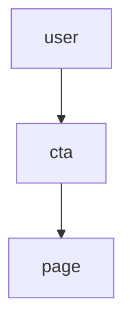

# Design Context (Draft)

## Decisions
D-01: Adopt systematic spacing scale (source: design-system-audit)
D-02: Expert archetype drives typography (source: brand-context)

## Must-Haves
M-01: Secondary buttons meet AA contrast (source: accessibility-baseline)

## Connections
figma: recommended (token sync)

## Architectural Responsibility Map
- Tier 1: Button, Card
- Tier 2: App shell

## Flow Diagram

## Open Questions
- Confirm primary brand color
